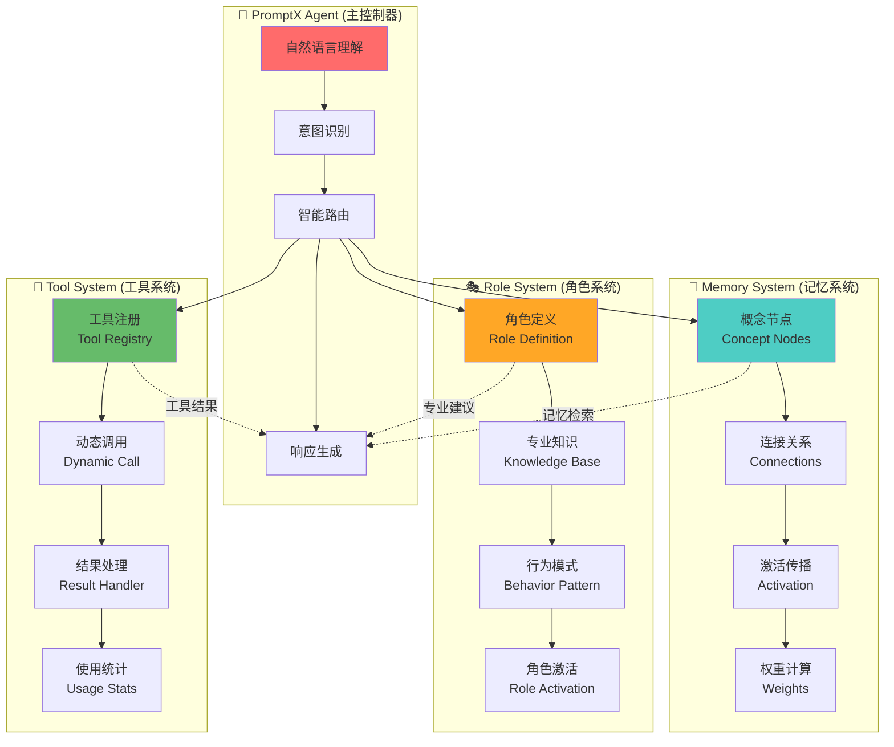
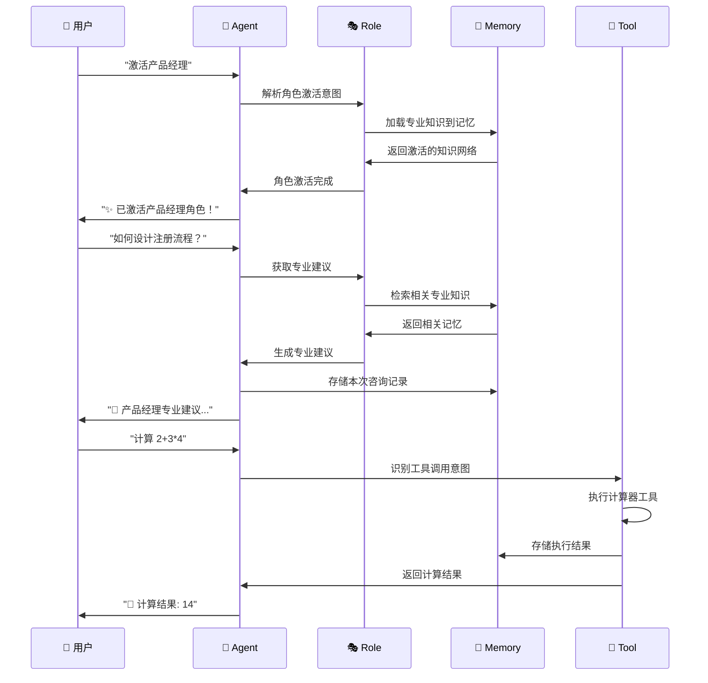

# 🏗️ PromptX Mini 架构设计

## 🎯 核心理念的极简实现

这个300行代码的实现展示了PromptX的核心魔法：**如何让AI从"万金油"变成"专业专家"**

## 🧠 系统架构图



## 🔄 工作流程



## 📊 核心组件详解

### 1. 🧠 Memory System - 认知记忆系统

**设计理念**: 模拟人脑的联想记忆机制

```javascript
// 核心数据结构
{
  nodes: Map<概念, {内容, 时间戳, 访问次数}>,
  connections: Map<概念, Set<相关概念>>,
  activations: Map<概念, 激活强度>
}

// 核心算法
remember(概念, 内容, 相关概念) {
  // 1. 存储概念节点
  // 2. 建立双向连接
  // 3. 更新激活权重
}

recall(查询) {
  // 1. 直接匹配
  // 2. 激活传播
  // 3. 权重排序
  // 4. 返回结果
}
```

**创新点**:
- ✅ 双向连接关系
- ✅ 激活强度传播
- ✅ 使用频率权重
- ✅ 语义相似度匹配

### 2. 🎭 Role System - 角色专业化系统

**设计理念**: 让AI获得专业身份和知识体系

```javascript
// 角色数据结构
{
  name: "产品经理",
  knowledge: ["用户体验", "敏捷开发", "数据分析"],
  behavior: {
    style: "结构化思考，用户导向",
    approach: "先理解用户需求，再提供解决方案"
  }
}

// 激活流程
activateRole(roleId) {
  // 1. 加载角色定义
  // 2. 激活专业知识
  // 3. 设置行为模式
  // 4. 返回激活状态
}
```

**创新点**:
- ✅ 知识与记忆系统集成
- ✅ 行为模式定义
- ✅ 专业建议生成
- ✅ 角色状态管理

### 3. 🔧 Tool System - 工具集成系统

**设计理念**: 让AI获得真实世界的操作能力

```javascript
// 工具接口标准
{
  name: "工具名称",
  description: "工具描述", 
  parameters: ["参数1", "参数2"],
  execute: (参数) => { 返回结果 }
}

// 执行流程
executeTool(toolId, ...args) {
  // 1. 验证工具存在
  // 2. 执行工具逻辑
  // 3. 处理执行结果
  // 4. 记录使用统计
}
```

**创新点**:
- ✅ 统一的工具接口
- ✅ 动态工具注册
- ✅ 智能工具推荐
- ✅ 执行结果缓存

### 4. 🤖 Agent - 智能代理系统

**设计理念**: 统一的交互入口和智能路由

```javascript
// 意图识别映射
const intentMap = {
  "激活": handleRoleActivation,
  "计算": handleCalculation,
  "分析": handleTextAnalysis,
  "状态": handleStatusQuery
}

// 处理流程
processInput(input) {
  // 1. 解析用户意图
  // 2. 路由到对应处理器
  // 3. 整合多系统结果
  // 4. 生成自然语言响应
}
```

**创新点**:
- ✅ 自然语言意图识别
- ✅ 多系统协调
- ✅ 上下文管理
- ✅ 智能响应生成

## 🎯 与完整版PromptX的对比

| 维度 | PromptX Mini | 完整版 PromptX | 实现复杂度 |
|------|-------------|---------------|-----------|
| **记忆系统** | 简化图结构 | 完整认知网络 | 1:10 |
| **角色系统** | 3个内置角色 | 丰富角色生态 | 1:20 |
| **工具系统** | 基础框架 | 完整ToolX | 1:15 |
| **协议支持** | 命令行 | MCP协议 | 1:8 |
| **部署方式** | 单文件 | 分布式 | 1:25 |

## 🚀 核心价值体现

### 1. 🎭 角色专业化的本质
```
传统AI: "我是AI助手，可以帮您..."
PromptX: "我是产品经理，从用户体验角度建议..."
```

### 2. 🧠 记忆系统的威力
```
无记忆: 每次都要重新解释背景
有记忆: 自动关联之前的讨论和知识
```

### 3. 🔧 工具集成的价值
```
纯对话: 只能提供建议和信息
有工具: 可以执行计算、分析、存储等实际操作
```

### 4. 💬 自然交互的魅力
```
命令式: execute_tool("calculator", "2+3")
自然式: "帮我计算一下 2+3"
```

## 🎓 学习收获

通过这个极简实现，您应该理解了：

1. **AI专业化不是提示词工程**，而是完整的知识体系和行为模式
2. **记忆系统是AI智能的关键**，让AI具有持续学习和关联能力
3. **工具集成让AI获得真实能力**，从"说"到"做"的跨越
4. **自然交互是用户体验的核心**，降低使用门槛

## 🔮 扩展方向

### 短期扩展 (1-2天)
- 🎭 添加更多专业角色
- 🔧 集成更多实用工具
- 🧠 优化记忆检索算法
- 💬 改进意图识别

### 中期扩展 (1-2周)
- 🌐 Web界面支持
- 📊 可视化记忆网络
- 🔄 角色间协作
- 📱 移动端适配

### 长期扩展 (1-2月)
- 🤖 接入真实LLM
- 🔗 MCP协议支持
- ☁️ 云端部署
- 🎨 图形化角色创建

---

**🎯 这就是PromptX的核心魔法 - 用最简单的代码，展示最深刻的AI理念！**